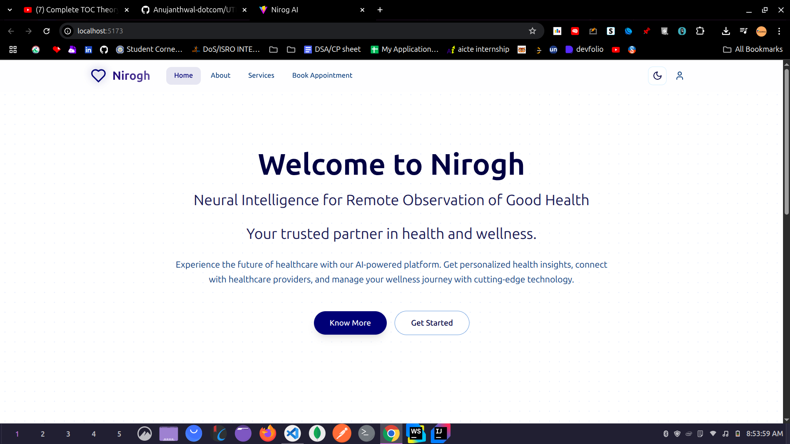
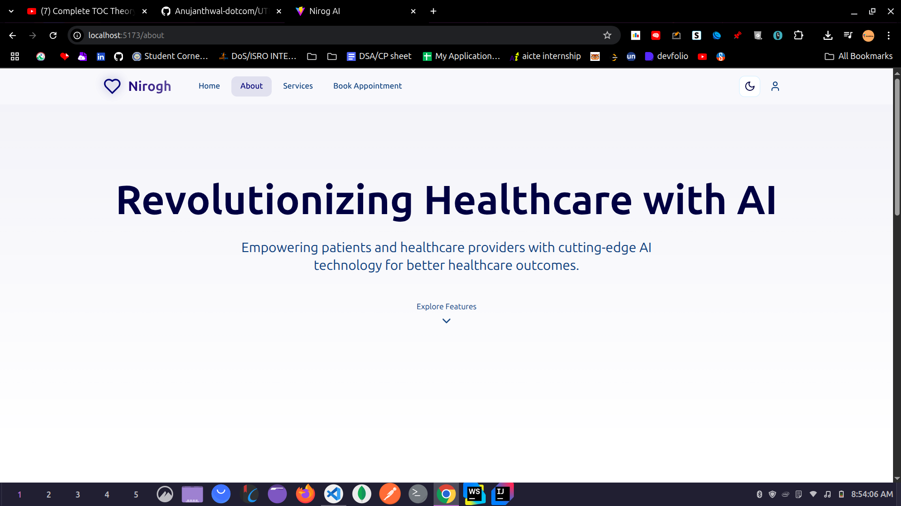
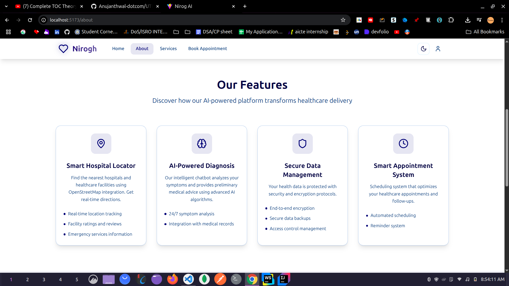
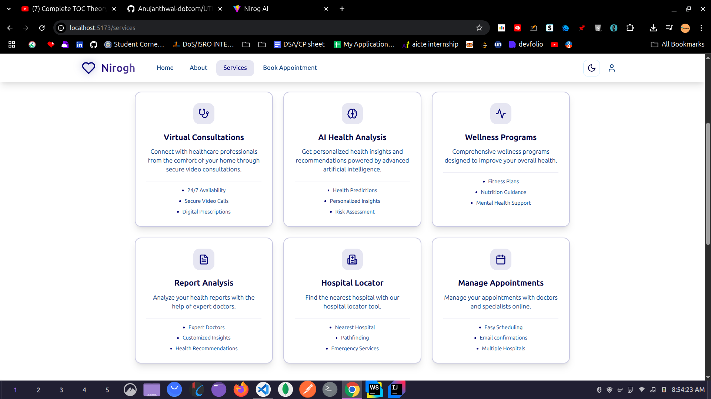
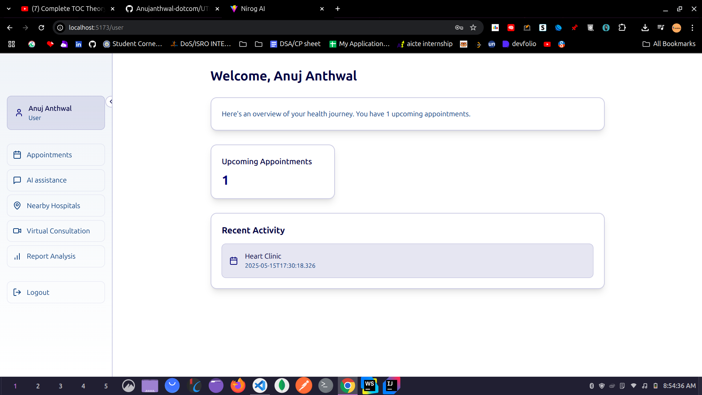
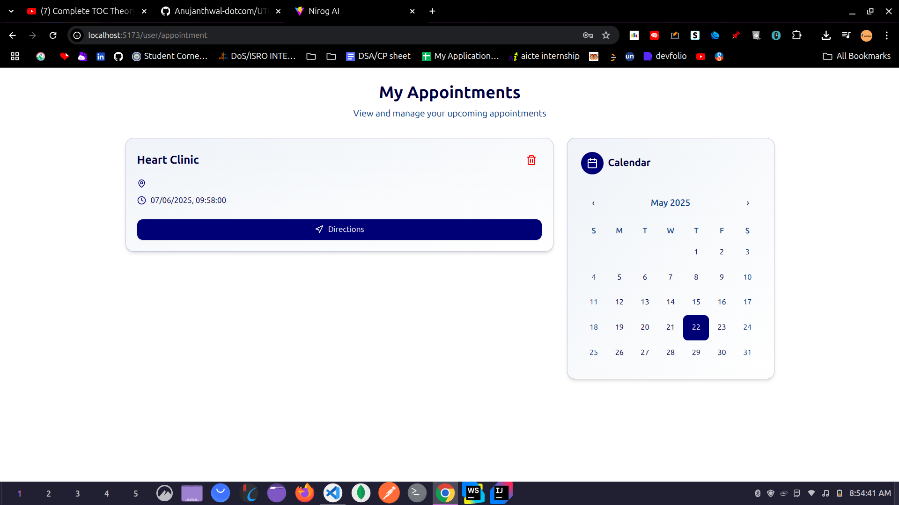
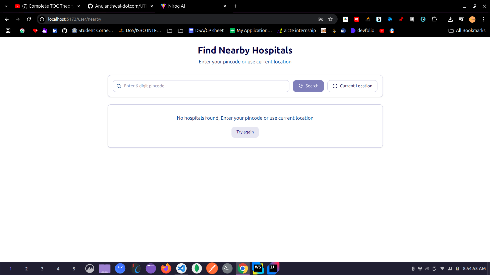

# 📊 Nirog AI — Your AI-Powered Personal Health Companion

**Nirog AI** is an intelligent, multimodal health tracking and advisory application built using **Spring Boot** (backend) and **React + Vite** (frontend). It empowers users to log symptoms through voice or text, retrieves contextual knowledge from trusted medical documents (like PDFs), and responds with relevant health advice — all using state-of-the-art AI.

---

## 🚀 Tech Stack

| Layer         | Technology                                    |
| ------------- | --------------------------------------------- |
| **Frontend**  | React 19, Vite 6, TailwindCSS, MUI            |
| **Backend**   | Spring Boot, LangChain (Python API bridge)    |
| **AI**        | Whisper (for voice transcription), OpenAI/GPT |
| **Embedding** | FAISS / ChromaDB, PDF ingestion               |
| **UI/UX**     | Tailwind CSS, MUI, Framer Motion              |

---

## 📸 Features at a Glance

* 🎤 **Voice-to-Text Input**: Users can speak symptoms via mic or upload a voice note.
* 📄 **PDF Knowledge Base**: Medical books are parsed and embedded for intelligent querying.
* 💬 **Contextual Answers**: LLM provides human-like health suggestions.
* 🗂️ **History & Records**: Optionally log past interactions (coming soon).
* 📱 **Responsive Design**: Works seamlessly on mobile and web.

---

## 🧪 Screenshots







---

## 🛠️ How to Run Locally

### 🔧 Backend (Spring Boot)

1. Clone the backend repo
2. Install Java 21 and Maven
3. Start MongoDB
4. Run:

   ```bash
   ./mvnw spring-boot:run
   ```

### 💻 Frontend (React + Vite)

```bash
git clone https://github.com/yourusername/nirog-ai.git
cd nirog-ai/utkarsh-fe
npm install
npm run dev
```

---

## 📂 Folder Structure

```bash
utkarsh-fe/
├── src/
│   ├── components/      # Reusable UI
│   ├── pages/           # Calendar, Logs, HealthQuery
│   ├── hooks/           # Custom React hooks
│   ├── assets/          # Icons, Logos
│   ├── App.jsx
│   └── main.jsx
├── public/
├── package.json
├── tailwind.config.js
└── vite.config.js
```

---

## ⚙️ Integrations

| Service          | Role                                     |   |
| ---------------- | ---------------------------------------- | - |
| `LangChain`      | Contextual search and retrieval from PDF |   |
| `OpenAI` / `LLM` | Response generation                      |   |
| `Spring Boot`    | Core backend APIs                        |   |
| `MongoDB`        | User and interaction storage             |   |

---

## 📌 Future Enhancements

* 🔔 Health Alerts / Early Diagnosis
* 🧪 Doctor Mode / Export Logs
* 🧠 Symptom-to-Disease Analysis
* 📊 Dashboard with Weekly Health Reports
* 📱 Android App (React Native planned)

---

## 🤝 Contributing

PRs and contributions welcome! Just fork the repo and make sure your code follows our conventions (`eslint`, `tailwind`, etc).

---

## 🧑‍💼 Developed By

> Built with ❤️ by **Anuj Anthwal and Team**
> Nirog AI – Making preventive care smarter, accessible, and AI-powered.
